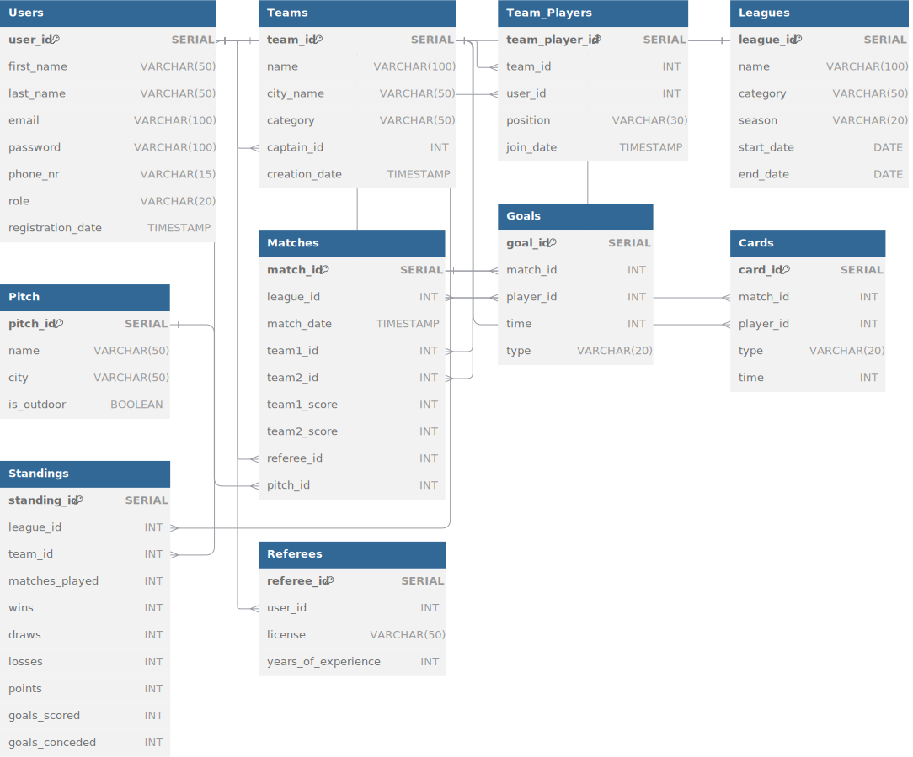

# Database_project - Documentation
Fully User-Integrated Database For Association Of Football Divisions And Games

## How to run?
The database is built on an online, free server space known as Railway, the database's "image" is shared in a file section as a db.dump so feel encouraged to check it out.
You can type the following snippet of code:
```sh
createdb bazunia_byq
pg_restore --dbname=bazunia_byq --no-owner --clean db.dump

## Workflow environment
It is required to have fully configured Postgresql, we recommend a 17.2 version in a version on your local machine.

## Project general requirements
Each team is responsible for creating and implementing its own database project, covering the full system lifecycle: from requirements analysis, through database schema design and implementation, to testing and technical documentation. You can work with any database management system (e.g., PostgreSQL, MariaDB, MySQL, Oracle, SQL Server), depending on your preferences and experience. Each team member is responsible for a specific area of work (e.g., requirements analysis, logical and physical design, function implementation, query optimization, documentation). Both teamwork and individual contributions will be evaluated.

## Project Requirements that we handled:
- ✔ Correctly functioning core database features  
- ✔ Schema design following basic normalization rules (2NF)  
- ✔ Simple user and technical documentation  
- ✔ Advanced functionality, including complex SQL queries (e.g., nested queries, views)  
- ✔ Use of triggers or stored procedures/functions specific to the chosen DBMS  
- ✔ Well-prepared technical documentation with ERD diagrams and implementation descriptions  
- ✔ Database structure meeting 3NF standards  
- ✔ Implementation of transactions and different isolation levels  
- ✔ Data security considerations (roles, permissions)  


# Database Schema

## Data structure

### Table: Users
| Field Name       | Data Type   | Length  | Description                                      |
|------------------|-------------|---------|--------------------------------------------------|
| `user_id`        | SERIAL      | -       | Unique identifier for each user (Primary Key).   |
| `first_name`     | VARCHAR     | 50      | First name of the user.                         |
| `last_name`      | VARCHAR     | 50      | Last name of the user.                          |
| `email`          | VARCHAR     | 100     | Email address of the user.                      |
| `password`       | VARCHAR     | 100     | Encrypted password of the user.                 |
| `phone_nr`       | VARCHAR     | 15      | Phone number of the user.                       |
| `role`           | VARCHAR     | 20      | Role of the user (e.g., player, referee).       |
| `registration_date` | TIMESTAMP | -       | Date and time the user was registered.          |

## Users Table
- **Primary Key:** `user_id` uniquely identifies each user.
- **Mandatory Fields:** `first_name`, `last_name`, `email`, and `password` must have values.
- **Unique Constraint:** `email` must contain unique values.
- **Optional Fields:** `phone_nr`, `role`, and `registration_date` can be left empty.
- **Length Restrictions:** `first_name` and `last_name` are limited to 50 characters, while `email` can have up to 100 characters.


### Table: Teams
| Field Name       | Data Type   | Length  | Description                                      |
|------------------|-------------|---------|--------------------------------------------------|
| `team_id`        | SERIAL      | -       | Unique identifier for each team (Primary Key).   |
| `name`           | VARCHAR     | 100     | Name of the team.                               |
| `city_name`      | VARCHAR     | 50      | City where the team is based.                   |
| `category`       | VARCHAR     | 50      | Category of the team (e.g., amateur, professional). |
| `captain_id`     | INT         | -       | Foreign key to `Users.user_id` (team captain).  |
| `creation_date`  | TIMESTAMP   | -       | Date and time the team was created.             |

## Teams Table
- **Primary Key:** `team_id` uniquely identifies each team.
- **Mandatory Fields:** `name` and `category` must have values.
- **Foreign Keys:** `captain_id` references `user_id` in the Users table.
- **Length Restrictions:** `name` is limited to 100 characters, and `city_name` to 50 characters.


### Table: Team_Players
| Field Name       | Data Type   | Length  | Description                                      |
|------------------|-------------|---------|--------------------------------------------------|
| `team_player_id` | SERIAL      | -       | Unique identifier for each team-player relation (Primary Key). |
| `team_id`        | INT         | -       | Foreign key to `Teams.team_id`.                 |
| `user_id`        | INT         | -       | Foreign key to `Users.user_id`.                 |
| `position`       | VARCHAR     | 30      | Position of the player (e.g., goalkeeper, defender). |
| `join_date`      | TIMESTAMP   | -       | Date and time the player joined the team.       |

## Team_Players Table
- **Primary Key:** `team_player_id` uniquely identifies each player-team relation.
- **Foreign Keys:** `team_id` references `team_id` in the Teams table, and `user_id` references `user_id` in the Users table.
- **Optional Fields:** `position` and `join_date` can be left empty.
- **Length Restrictions:** `position` is limited to 30 characters.

  
### Table: Leagues
| Field Name       | Data Type   | Length  | Description                                      |
|------------------|-------------|---------|--------------------------------------------------|
| `league_id`      | SERIAL      | -       | Unique identifier for each league (Primary Key). |
| `name`           | VARCHAR     | 100     | Name of the league.                             |
| `category`       | VARCHAR     | 50      | Category of the league (e.g., junior, senior).  |
| `season`         | VARCHAR     | 20      | Season of the league (e.g., 2025).              |
| `start_date`     | DATE        | -       | Start date of the league.                       |
| `end_date`       | DATE        | -       | End date of the league.                         |

## Leagues Table
- **Primary Key:** `league_id` uniquely identifies each league.
- **Mandatory Fields:** `name`, `category`, and `season` must have values.
- **Length Restrictions:** `name` is limited to 100 characters, `category` to 50, and `season` to 20 characters.


### Table: Pitch
| Field Name        | Data Type     | Length     | Description                                       |
|-------------------|---------------|------------|---------------------------------------------------|
| `pitch_id`        | `SERIAL`      | -          | Unique identifier for each pitch (Primary Key).   |
| `name`            | `VARCHAR(50)` | 50         | Name of the pitch (e.g., "Stadium 1").            |
| `city`            | `VARCHAR(50)` | 50         | City where the pitch is located.                  |
| `is_outdoor`      | `BOOLEAN`     | -          | Indicates if the pitch is outdoor (default `TRUE`). |

## Pitch Table
- **Primary Key:** `pitch_id` uniquely identifies each pitch.
- **Mandatory Fields:** `name`, `city`, and `is_outdoor` must have values.
- **Length Restrictions:** `name` and `city` are limited to 50 characters.
- **Default Values:** `is_outdoor` defaults to `TRUE`.


### Table: Matches
| Field Name       | Data Type   | Length  | Description                                      |
|------------------|-------------|---------|--------------------------------------------------|
| `match_id`       | SERIAL      | -       | Unique identifier for each match (Primary Key).  |
| `league_id`      | INT         | -       | Foreign key to `Leagues.league_id`.             |
| `match_date`     | TIMESTAMP   | -       | Date and time the match was played.             |
| `team1_id`       | INT         | -       | Foreign key to `Teams.team_id` (first team).    |
| `team2_id`       | INT         | -       | Foreign key to `Teams.team_id` (second team).   |
| `team1_score`    | INT         | -       | Score of the first team.                        |
| `team2_score`    | INT         | -       | Score of the second team.                       |
| `referee_id`     | INT         | -       | Foreign key to `Users.user_id` (referee).       |
| `pitch_id`       | INT         | -       | Foreign key to `Pitch.pitch_id` (referee).       |

## Matches Table
- **Primary Key:** `match_id` uniquely identifies each match.
- **Foreign Keys:** `league_id` references `league_id` in the Leagues table, `team1_id` and `team2_id` reference `team_id` in the Teams table, `referee_id` references `user_id` in the Users table, and `pitch_id` references `pitch_id` in the Pitch table.
- **Optional Fields:** `team1_score` and `team2_score` can be left empty.

  
### Table: Goals
| Field Name       | Data Type   | Length  | Description                                      |
|------------------|-------------|---------|--------------------------------------------------|
| `goal_id`        | SERIAL      | -       | Unique identifier for each goal (Primary Key).   |
| `match_id`       | INT         | -       | Foreign key to `Matches.match_id`.              |
| `player_id`      | INT         | -       | Foreign key to `Users.user_id` (player who scored). |
| `time`           | INT         | -       | Minute of the match when the goal was scored.   |
| `type`           | VARCHAR     | 20      | Type of goal (e.g., regular, own goal, penalty). |

## Goals Table
- **Primary Key:** `goal_id` uniquely identifies each goal.
- **Foreign Keys:** `match_id` references `match_id` in the Matches table, and `player_id` references `user_id` in the Users table.
- **Mandatory Fields:** `time` and `type` must have values.
- **Length Restrictions:** `type` is limited to 20 characters.
  

### Table: Cards
| Field Name       | Data Type   | Length  | Description                                      |
|------------------|-------------|---------|--------------------------------------------------|
| `card_id`        | SERIAL      | -       | Unique identifier for each card (Primary Key).   |
| `match_id`       | INT         | -       | Foreign key to `Matches.match_id`.              |
| `player_id`      | INT         | -       | Foreign key to `Users.user_id` (player who received the card). |
| `type`           | VARCHAR     | 20      | Type of card (yellow, red).                     |
| `time`           | INT         | -       | Minute of the match when the card was issued.   |

## Cards Table
- **Primary Key:** `card_id` uniquely identifies each card.
- **Foreign Keys:** `match_id` references `match_id` in the Matches table, and `player_id` references `user_id` in the Users table.
- **Mandatory Fields:** `type` and `time` must have values.
- **Length Restrictions:** `type` is limited to 20 characters.
  

### Table: Standings
| Field Name       | Data Type   | Length  | Description                                      |
|------------------|-------------|---------|--------------------------------------------------|
| `standing_id`    | SERIAL      | -       | Unique identifier for each league standing entry (Primary Key). |
| `league_id`      | INT         | -       | Foreign key to `Leagues.league_id`.             |
| `team_id`        | INT         | -       | Foreign key to `Teams.team_id`.                 |
| `matches_played` | INT         | -       | Number of matches played by the team.           |
| `wins`           | INT         | -       | Number of matches won by the team.              |
| `draws`          | INT         | -       | Number of matches drawn by the team.            |
| `losses`         | INT         | -       | Number of matches lost by the team.             |
| `points`         | INT         | -       | Total points of the team.                       |
| `goals_scored`   | INT         | -       | Number of goals scored by the team.             |
| `goals_conceded` | INT         | -       | Number of goals conceded by the team.           |

## Standings Table
- **Primary Key:** `standing_id` uniquely identifies each league standing entry.
- **Foreign Keys:** `league_id` references `league_id` in the Leagues table, and `team_id` references `team_id` in the Teams table.
- **Mandatory Fields:** `matches_played`, `wins`, `draws`, `losses`, `points`, `goals_scored`, and `goals_conceded` must have values.


### Table: Referees
| Field Name       | Data Type   | Length  | Description                                      |
|------------------|-------------|---------|--------------------------------------------------|
| `referee_id`     | SERIAL      | -       | Unique identifier for each referee (Primary Key).|
| `user_id`        | INT         | -       | Foreign key to `Users.user_id`.                 |
| `license`        | VARCHAR     | 50      | Referee license (e.g., UEFA, local).            |
| `years_of_experience` | INT    | -       | Number of years of experience as a referee.     |

## Referees Table
- **Primary Key:** `referee_id` uniquely identifies each referee.
- **Foreign Keys:** `user_id` references `user_id` in the Users table.
- **Mandatory Fields:** `license` and `years_of_experience` must have values.
- **Length Restrictions:** `license` is limited to 50 characters.


## Diagram ERD

